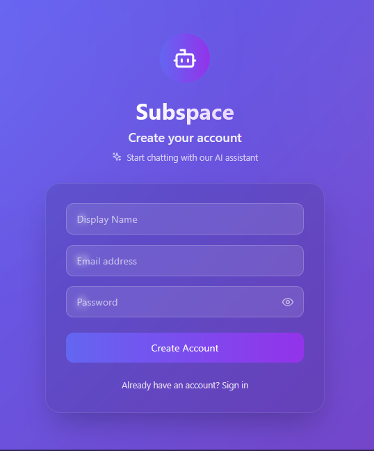
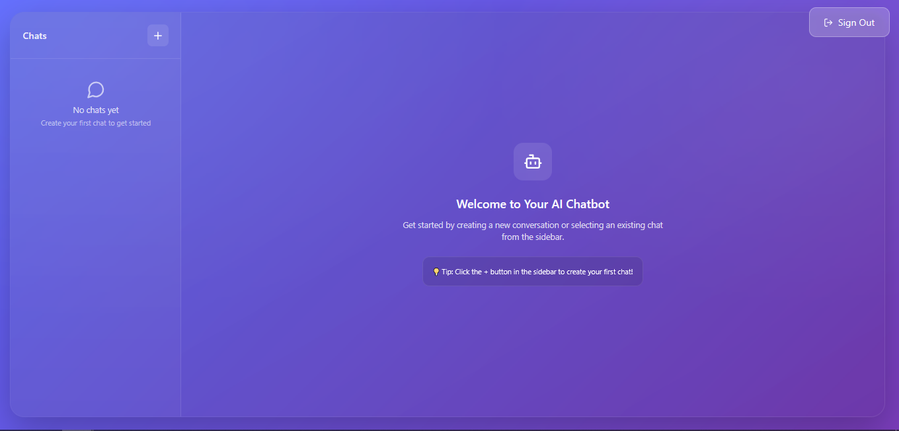
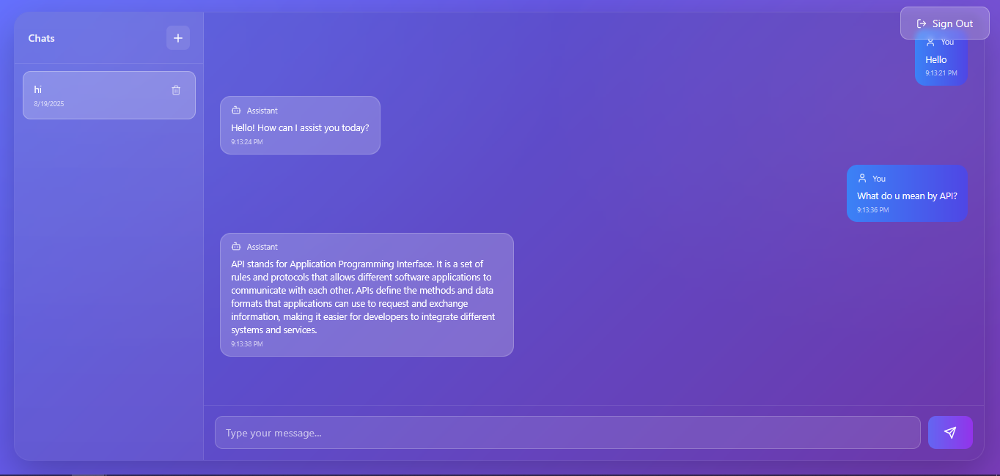

# Subspace Chatbot Application

A modern chatbot application built with React, Nhost Auth, Hasura GraphQL, and n8n workflows, integrated with OpenRouter AI.

## 🚀 Live Demo

**Deployed Application**: https://aditya-narayan-raul-subspace-chatbot.netlify.app/

## 📋 Features

- **Email Authentication**: Secure sign-up/sign-in with Nhost Auth
- **Real-time Chat**: GraphQL subscriptions for live message updates
- **AI Chatbot**: Powered by OpenRouter's free GPT-3.5-turbo model
- **Secure Permissions**: Row-level security and proper user isolation
- **Modern UI**: Beautiful, responsive design with Tailwind CSS
- **GraphQL Only**: All frontend communication uses GraphQL (no REST)







## 🏗️ Architecture

```
Frontend (React + Vite)
↓ GraphQL Queries/Mutations/Subscriptions
Hasura GraphQL Engine
↓ Actions
n8n Workflow
↓ HTTP Requests
OpenRouter AI API
```

## 🛠️ Technology Stack

- **Frontend**: React 18, TypeScript, Vite, Tailwind CSS
- **Authentication**: Nhost Auth
- **Backend**: Hasura GraphQL Engine
- **Database**: PostgreSQL with Row-Level Security
- **Workflow Engine**: n8n
- **AI**: OpenRouter (GPT-3.5-turbo)
- **Deployment**: Netlify

## 📦 Installation & Setup

### Prerequisites

- Node.js 18+ and npm
- Nhost account
- n8n cloud account (or self-hosted)
- OpenRouter account

### 1. Clone and Install

```bash
git clone <repository-url>
cd chatbot-app
npm install
```

### 2. Environment Configuration

Create `.env` file:

```env
VITE_NHOST_SUBDOMAIN=your-nhost-subdomain
VITE_NHOST_REGION=us-east-1
VITE_HASURA_ENDPOINT=https://your-project.nhost.run/v1/graphql
VITE_HASURA_WS_ENDPOINT=wss://your-project.nhost.run/v1/graphql
VITE_N8N_WEBHOOK_URL=https://your-n8n-instance.n8n.cloud/webhook/chatbot
```

### 3. Database Setup

Execute the SQL from `database/schema.md` in your Nhost SQL editor:

1. Create tables (chats, messages)
2. Set up Row-Level Security policies
3. Create relationships in Hasura
4. Configure permissions for the 'user' role

### 4. Hasura Actions Setup

1. Go to Hasura Console → Actions
2. Create new action `sendChatbotMessage`
3. Use the configuration from `hasura/actions.md`
4. Set webhook URL to your n8n webhook

### 5. n8n Workflow Setup

1. Create new workflow in n8n
2. Set up webhook trigger at `/webhook/chatbot`
3. Add environment variables:
   - `HASURA_ENDPOINT`
   - `HASURA_ADMIN_SECRET`
   - `OPENROUTER_API_KEY`
4. Import workflow configuration from `n8n/workflow-config.md`

### 6. Deploy to Netlify

```bash
npm run build
```

1. Connect your GitHub repository to Netlify
2. Set build command: `npm run build`
3. Set publish directory: `dist`
4. Add environment variables in Netlify dashboard

## 🔧 Development

```bash
# Start development server
npm run dev

# Build for production
npm run build

# Preview production build
npm run preview
```

## 🔒 Security Features

- **Row-Level Security**: Users can only access their own chats and messages
- **Authentication Required**: All features require valid JWT token
- **Input Validation**: Proper validation in both frontend and n8n workflow
- **CORS Configuration**: Secure cross-origin resource sharing
- **CSP Headers**: Content Security Policy for XSS protection

## 📊 Database Schema

### Chats Table
- `id` (UUID, Primary Key)
- `title` (TEXT)
- `user_id` (UUID, Foreign Key)
- `created_at` (TIMESTAMPTZ)
- `updated_at` (TIMESTAMPTZ)

### Messages Table
- `id` (UUID, Primary Key)
- `chat_id` (UUID, Foreign Key)
- `user_id` (UUID, Foreign Key)
- `content` (TEXT)
- `is_bot` (BOOLEAN)
- `created_at` (TIMESTAMPTZ)

## 🔄 Data Flow

1. User sends message → GraphQL mutation
2. Message saved to database
3. Hasura Action triggers n8n webhook
4. n8n validates user ownership
5. n8n calls OpenRouter API
6. Bot response saved to database
7. Frontend receives update via GraphQL subscription

## 🚨 Troubleshooting

### Common Issues

**Authentication Errors**
- Check Nhost configuration
- Verify JWT token validity
- Ensure user is properly authenticated

**GraphQL Errors**
- Check Hasura permissions
- Verify table relationships
- Check RLS policies

**n8n Webhook Issues**
- Verify webhook URL is accessible
- Check environment variables
- Validate request payload format

**OpenRouter API Errors**
- Check API key validity
- Verify rate limits
- Check model availability

## 📝 API Documentation

### GraphQL Queries

```graphql
# Get user's chats
query GetChats {
  chats(order_by: { updated_at: desc }) {
    id
    title
    created_at
    updated_at
  }
}

# Get chat messages
query GetChatMessages($chatId: uuid!) {
  messages(where: { chat_id: { _eq: $chatId } }) {
    id
    content
    is_bot
    created_at
  }
}
```

### GraphQL Mutations

```graphql
# Create new chat
mutation CreateChat($title: String!) {
  insert_chats_one(object: { title: $title }) {
    id
    title
  }
}

# Send message
mutation SendMessage($chatId: uuid!, $content: String!) {
  insert_messages_one(
    object: { chat_id: $chatId, content: $content, is_bot: false }
  ) {
    id
    content
    created_at
  }
}

# Send chatbot message (Hasura Action)
mutation SendChatbotMessage($chatId: String!, $message: String!) {
  sendChatbotMessage(chatId: $chatId, message: $message) {
    success
    message
    response
  }
}
```

### GraphQL Subscriptions

```graphql
# Real-time messages
subscription MessagesSubscription($chatId: uuid!) {
  messages(where: { chat_id: { _eq: $chatId } }) {
    id
    content
    is_bot
    created_at
  }
}
```

## 🎯 Assignment Requirements Checklist

- ✅ Email Sign In/Sign Up using Nhost Auth
- ✅ Chat system using Hasura GraphQL queries, mutations, and subscriptions
- ✅ Chatbot powered by n8n connected to Hasura Actions
- ✅ OpenRouter integration (free model)
- ✅ Row-Level Security implementation
- ✅ Proper permissions for user role only
- ✅ GraphQL-only communication (no REST)
- ✅ Authenticated Hasura Action
- ✅ n8n workflow with user validation
- ✅ Real-time updates via subscriptions
- ✅ Hosted on Netlify

## 🤝 Contributing

1. Fork the repository
2. Create a feature branch
3. Make your changes
4. Submit a pull request

## 📄 License

This project is licensed under the MIT License.

## 📞 Support

For questions or issues, please contact:
- Email: rauladitya1234@gmail.com
- Linkedin: www.linkedin.com/in/aditya-raul-5929b4259

---

**Assignment Submission Format:**
```
Name: Your Name
Contact: Your Phone Number
Deployed: https://aditya-narayan-raul-subspace-chatbot.netlify.app/
```
